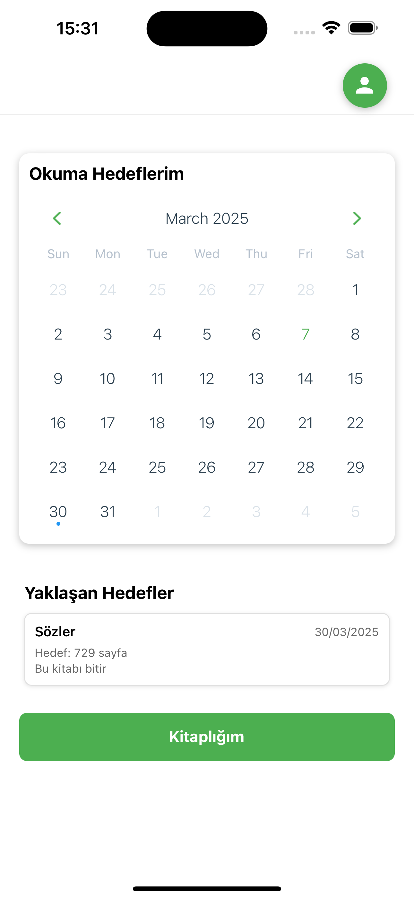
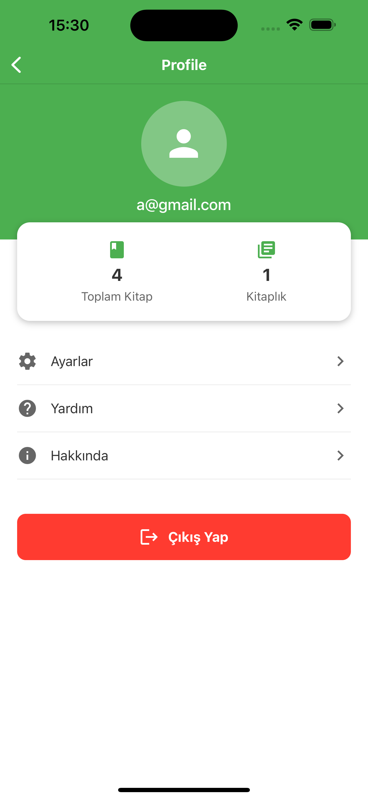
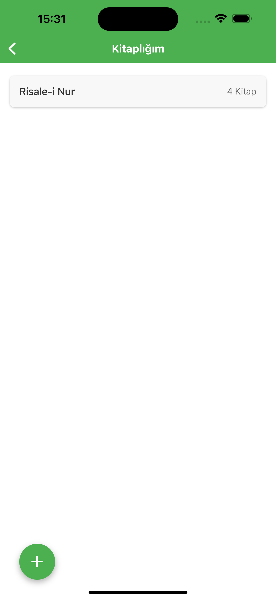
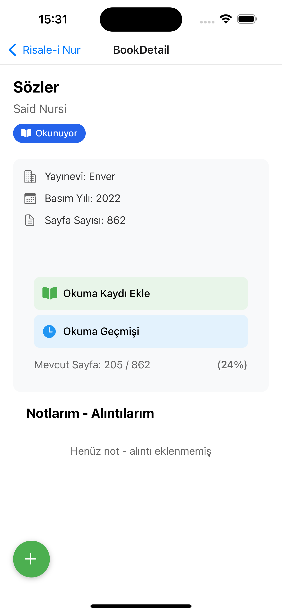
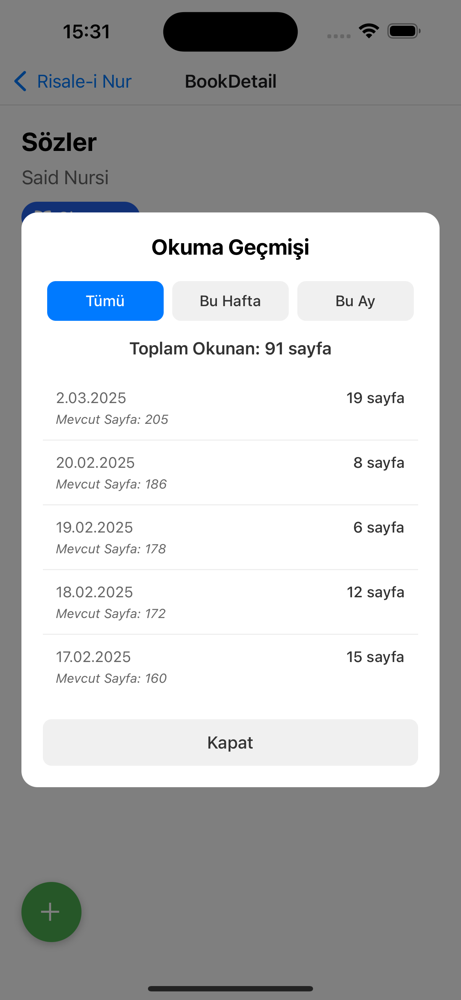

📚 **Kütüphane Uygulaması**

📖 **Proje Açıklaması**
Bu proje, kullanıcıların kitap okuma alışkanlıklarını takip edebilmeleri için geliştirilmiş bir kütüphane yönetim uygulamasıdır. Kullanıcılar, kitaplarını kaydedebilir, düzenleyebilir ve okuma süreçlerini takip edebilirler. Uygulama, okunan sayfa sayısını günlük olarak kaydetme, kitap bazında okuma ilerlemesini görme ve istatistiksel verilere ulaşma imkanı sunar.

🎯 **Amaçlar ve Özellikler**
- **Kitap Takibi:** Kullanıcılar, okudukları kitapları kategorilere ayırarak uygulamada saklayabilirler.
- **Günlük Okuma Sayısı Takibi:** Kullanıcılar, günlük okudukları sayfa sayısını kaydedebilir ve geçmişteki okuma verilerine ulaşabilirler.
- **İstatistiksel Veriler:** Haftalık, aylık veya belirli günlerdeki toplam okuma sayısı hesaplanabilir.
- **Sayfa Takibi:** Kullanıcılar, hangi sayfada kaldıklarını manuel olarak değiştirebilir veya otomatik olarak güncellenen sayfa sayısını takip edebilirler.
- **Kişisel Gelişim:** Kullanıcıların okuma alışkanlıklarını geliştirmelerine yardımcı olur, okuma hedeflerine ulaşmalarını kolaylaştırır.

🚀 **Kurulum Adımları**

1. **Proje dosyasını klonla:**
   ```bash
   git clone <repo_link>
   cd <project_folder>
   ```

2. **Bağımlılıkları yükle:**
   ```bash
   npm install
   ```

3. **Firebase yapılandırmasını ayarla:**
   - Firebase projesi oluştur ve **firebase-config.js** dosyasına API anahtarlarını ekle.

4. **Uygulamayı başlat:**
   ```bash
   npm start
   ```

### **Gerekli Bağımlılıklar**
- React Native
- Firebase (Firestore ve Authentication için)
- Diğer bağımlılıklar (React Navigation, Expo vb.)

📌 **Kullanım Senaryoları**

1. **Kitap Ekleme:**
   - Kullanıcı, uygulamaya giriş yaptıktan sonra **"Kitap Ekle"** butonuyla kitap ekleyebilir.
   - Kitap adı, yazar ve tür bilgilerini girerek kaydedebilir.

2. **Okuma Takibi Yapma:**
   - Kullanıcı, kitap detay sayfasına gidip **"Okuma Ekle"** butonuna tıklayarak günlük okuma sayfasını girebilir.
   - Örneğin, "Bugün 30 sayfa okudum" şeklinde giriş yapabilir.

3. **İstatistik Görüntüleme:**
   - Kullanıcı, **"Haftalık"**, **"Aylık"** veya **"Özel Tarih Aralığı"** seçerek okuma verilerini görüntüleyebilir.
   - Belirtilen tarihlerdeki toplam okuma sayısı hesaplanır ve gösterilir.

4. **Sayfa Takibi:**
   - Kullanıcı, okuma takibini elle güncelleyebilir.
   - Kitap sayfasının hangi kısmında kaldığını manuel olarak değiştirebilir.

### **Örnek Senaryo:**
1. Kullanıcı kitap ekler:  
   **Kitap Adı:** "Savaş ve Barış"  
   **Yazar:** Lev Tolstoy  
   **Tür:** Roman  

2. Günlük okuma ekler:  
   **Bugün Okunan Sayfa Sayısı:** 20  

3. Kullanıcı, **"Haftalık İstatistikler"** seçeneğini tıklayarak bu hafta okuduğu toplam sayfa sayısını görüntüler.

## 📸 Uygulama Ekran Görüntüleri

### **Giriş Ekranı**


### **Ana Sayfa**


### **Hedefler Ekranı**


### **Profil Sayfası**


### **Kitaplık Görünümü**


### **Kitap Detayı**


### **Okuma Geçmişi**



🛠 **Kullanılan Teknolojiler**

1. **Programlama Dili:**
   - **JavaScript (ES6+)** - Uygulama genelinde kullanılan temel dil.

2. **Framework:**
   - **React Native** - Mobil uygulama geliştirmek için kullanılan framework.

3. **Kütüphaneler:**
   - **Firebase** - Veritabanı ve kullanıcı kimlik doğrulama için kullanılır (Firestore, Firebase Authentication).
   - **React Navigation** - Uygulama içinde gezinme (navigasyon) işlemleri için.
   - **Expo** - React Native geliştirme ortamı, hızlı başlatma ve geliştirme için kullanılır.

Bu teknolojilerle uygulama geliştirilir ve kullanıcı verileri Firebase üzerinde saklanır.


## **İletişim**
Soruların veya geri bildirimlerin için benimle iletişime geçebilirsin:  
**E-posta:** chizir3@gmail.com  
**GitHub:** [GitHub Profili](https://github.com/hizircicekdag)
**LinkedIn:** [LinkedIn Profili](https://www.linkedin.com/in/hizircicekdag/)


